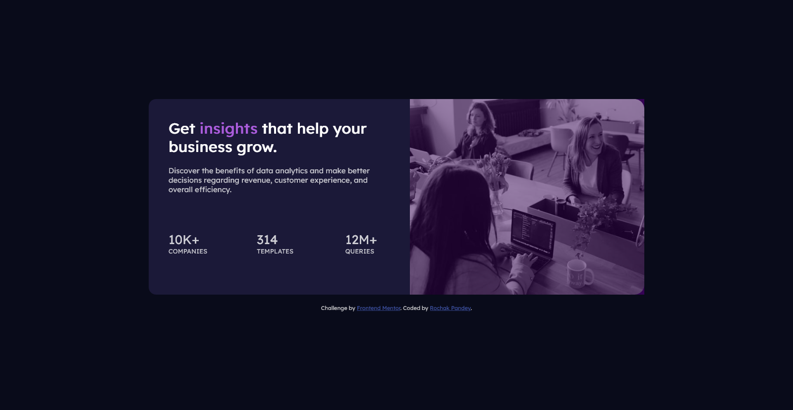

# Frontend Mentor - Stats preview card component solution

This is a solution to the [Stats preview card component challenge on Frontend Mentor](https://www.frontendmentor.io/challenges/stats-preview-card-component-8JqbgoU62). Frontend Mentor challenges help you improve your coding skills by building realistic projects. 

## Table of contents

- [The challenge](#the-challenge)
- [Screenshot](#screenshot)
- [Links](#links)
- [Built with](#built-with)
- [Author](#author)

## The Challenge

Users should be able to:

- View the optimal layout depending on their device's screen size

## Screenshot
####Mobile Layout

####Desktop Layout

### Links

- Live Site URL: [View Live site](https://frontendmentor-statscard.vercel.app)
- Frontend Mentor URL: [Rochak Pandey | Frontend Mentor](https://www.frontendmentor.io/profile/pandeyrochak)

### Built with

- HTML Semantic elements
- CSS
- Flexbox

### What I learned

- Designing mobile-first layout.
- Changing image based on screen size.
- Flexbox

### Author

- LinkedIn - [Rochak Pandey](https://www.linkedin.com/in/pandeyrochak)
- Frontend Mentor - [@pandeyrochak](https://www.frontendmentor.io/profile/pandeyrochak)
- Twitter - [@pandeyrochak56](https://www.twitter.com/pandeyrochak56)

